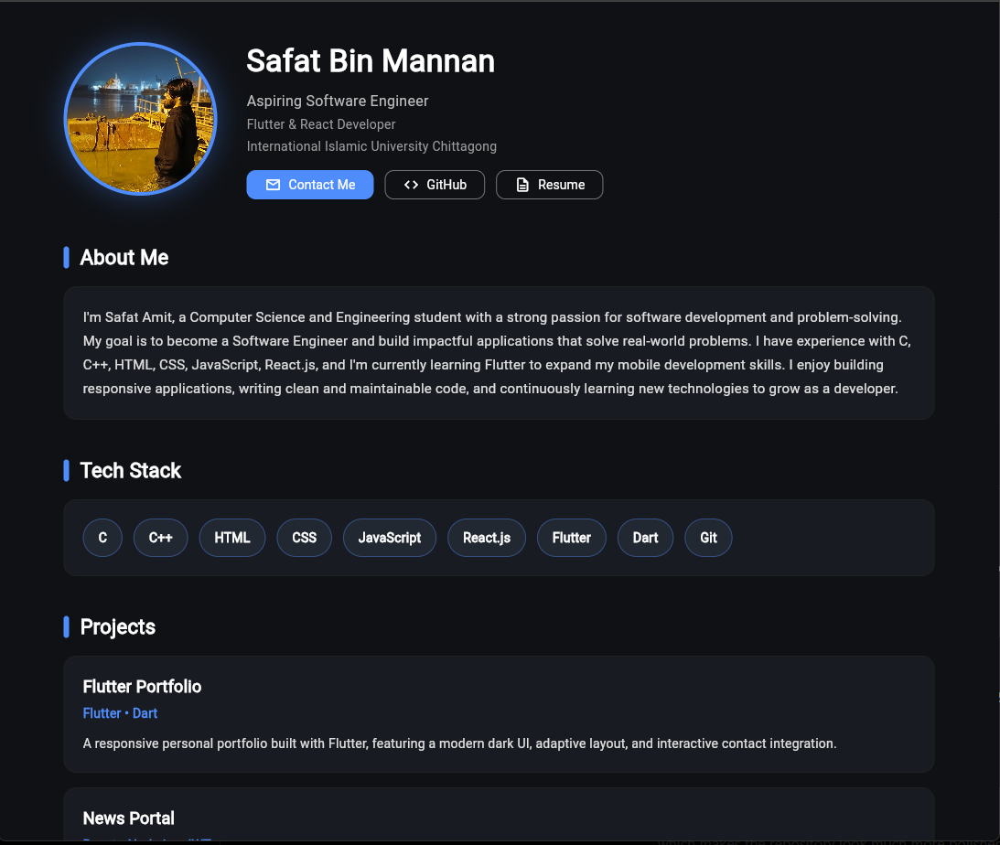
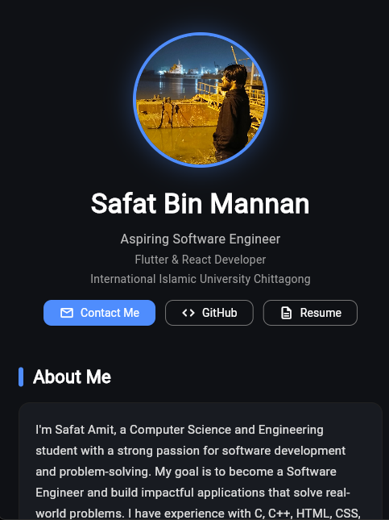

# 🚀 Safat Amit - Flutter Portfolio

A modern and responsive personal portfolio application built with **Flutter**. This project showcases my background, technical skills, education, and contact information in a clean and user-friendly interface.

---

## ✨ Features

* Responsive design for desktop and mobile
* Modern dark-themed UI
* About Me section
* Technical skills showcase
* Education section
* Contact information
* GitHub integration
* Easy to customize

---

## 🛠️ Tech Stack

* Flutter
* Dart
* Material Design

---

## 📁 Project Structure

```
lib/
│── main.dart          # Application entry point
│── home_page.dart     # Portfolio UI

assets/
└── images/
    └── profile.jpeg

web/
│── index.html
└── manifest.json

pubspec.yaml
```

---

## 🚀 Getting Started

Clone the repository:

```bash
git clone https://github.com/SaFat130/flutter-portfolio.git
```

Navigate to the project folder:

```bash
cd flutter-portfolio
```

Install dependencies:

```bash
flutter pub get
```

Run the application:

```bash
flutter run -d chrome
```

---

## 📸 Screenshots

Desktop Version

> 

Mobile Version

> 

---

## 🎯 Future Improvements

* Download Resume button
* Project showcase section
* Light/Dark mode switch
* Animations
* Social media links
* Experience section

---

## 👨‍💻 Author

**Safat Amit**

Aspiring Software Engineer

📍 Feni, Bangladesh

📧 Email: [safatamit@gmail.com](mailto:safatamit@gmail.com)

💻 GitHub: https://github.com/SaFat130

---


## Notes

- This project doesn't include the `android/`, `ios/`, `linux/`, `macos/`, or `windows/` platform folders.
  Flutter generates these automatically. If you want to run on Android/iOS/desktop and they're missing, run:
  ```bash
  flutter create .
  ```
  in the project root — this will safely add the missing platform folders without touching your `lib/` code.
